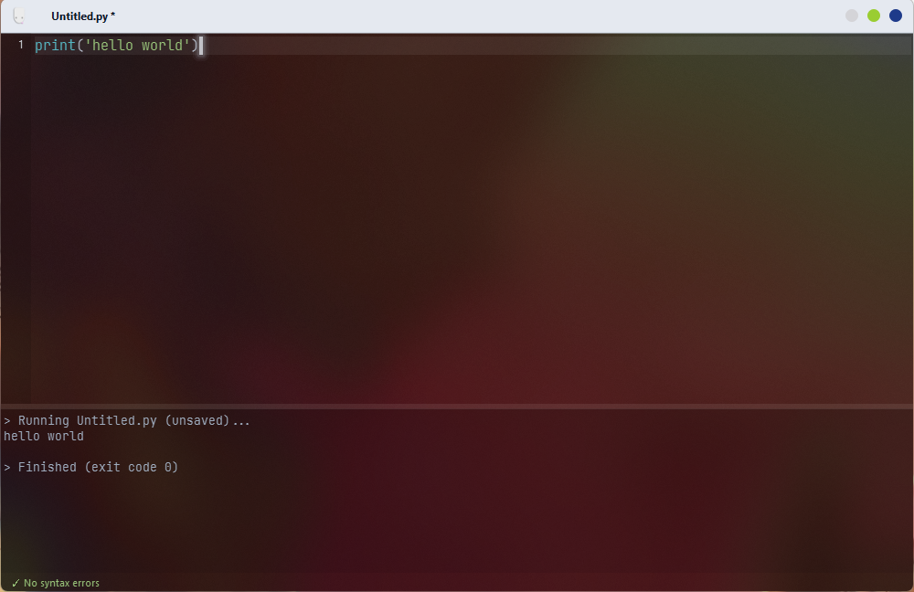

# Wiper IDE
or White Viper 
Is an IDE for **python** 

# Download

  

**visuals** 

  

features 
- simple 
- Dosent require you to save every run 
- beautiful interface 
- Linux like visuals 
- TINY size 
- works out of the box
